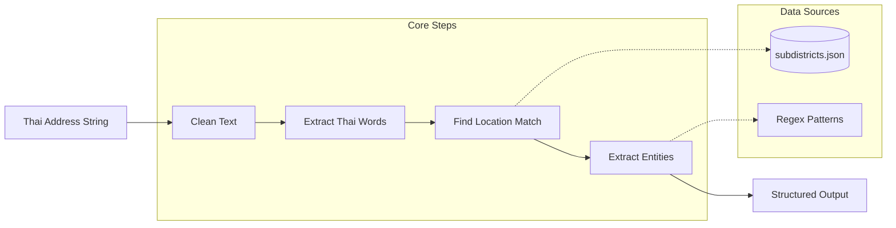

# Thai Address Splitter

split long address string(in Thai) to 'name', 'phone number', 'subdistrict', 'district', 'province', 'zipcode'

## Architecture

This library uses a class-based architecture with separated concerns:

- **`ThaiAddressSplitter`** - Main orchestrator class
- **`TextPreprocessor`** - Text cleaning and normalization
- **`LocationMatcher`** - Subdistrict database matching and scoring
- **`EntityExtractor`** - Name, phone, and address extraction
- **`Constants`** - Centralized patterns, keywords, and mappings

## How It Works



### Processing Steps

1. **Text Preprocessing**: 
   - Removes administrative prefixes (เขต, แขวง, จังหวัด, อำเภอ, ตำบล, etc.)
   - Normalizes whitespace and cleans input
2. **Word Extraction**: Splits text and filters Thai words with at least 2 characters
3. **Location Matching**: 
   - Searches each word against the subdistricts database
   - Calculates frequency scores for location confidence
4. **Entity Extraction**: 
   - Removes location words from text (zipcode → province → district → subdistrict)
   - Extracts names with title prefixes (นาย, นาง, คุณ, etc.) or without titles
   - Extracts phone numbers (starting with 06, 08, 09)
   - Remaining text becomes the address field

## Example

basic split
```js
const Splitter = require('../splitter');

(async () => {
    const input = 'คุณดอกฝ้าย สายเขียว 799/11 ถนนจักรแก้ว แขวงวังบูรพาภิรมย์ เขตพระนคร  กรุงเทพ 10200 เบอร์ 0911222333';
    const result = Splitter.split(input);
    console.log('result :', { input, result });
})();
```

## Tests
```
pnpm run test
```

