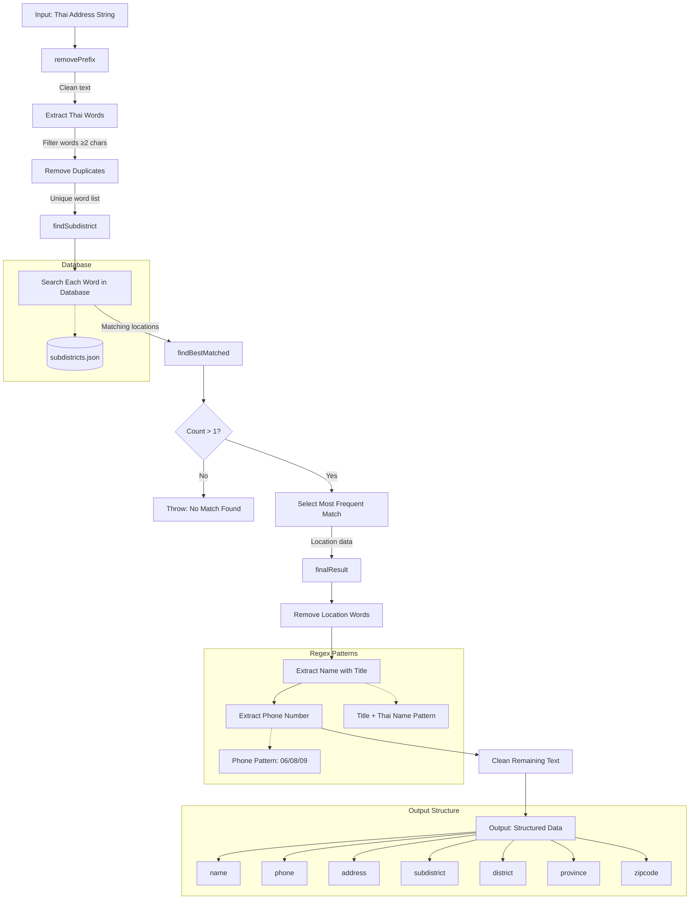

# Thai Address Splitter

split long address string(in Thai) to 'name', 'phone number', 'subdistrict', 'district', 'province', 'zipcode'

## How It Works



### Processing Steps

1. **Prefix Removal**: Removes administrative prefixes (เขต, แขวง, จังหวัด, อำเภอ, ตำบล, etc.)
2. **Word Extraction**: Splits text and filters Thai words with at least 2 characters
3. **Location Matching**: Searches each word against the subdistricts database
4. **Frequency Analysis**: Counts how many times each location appears in matches
5. **Entity Extraction**: 
   - Extracts names with title prefixes (นาย, นาง, คุณ, etc.)
   - Extracts phone numbers (starting with 06, 08, 09)
   - Remaining text becomes the address field

## Example

basic split
```js
const Splitter = require('../splitter');

(async () => {
    const input = 'คุณดอกฝ้าย สายเขียว 799/11 ถนนจักรแก้ว แขวงวังบูรพาภิรมย์ เขตพระนคร  กรุงเทพ 10200 เบอร์ 0911222333';
    const result = Splitter.split(input);
    console.log('result :', { input, result });
})();
```

## Tests
```
pnpm run test
```

## Know issues
- [ ] แยกชื่อไม่ได้ถ้าไม่มีคำนำหน้า
- [ ] ชื่อหรือนามสกุลที่คล้ายหรือเหมือนกับ ตำบล อำเภอ จังหวัด จะโดนตัดออก
- [ ] ถ้า input ใส่ชื่อ อำเภอ จังหวัด แบบย่อๆ เช่น "กรุงเทพ" แทนที่จะเป็น "กรุงเทพมหานคร" ชื่อพวกนั้นจะถูกส่งไปเก็บไว้ใน address ด้วย